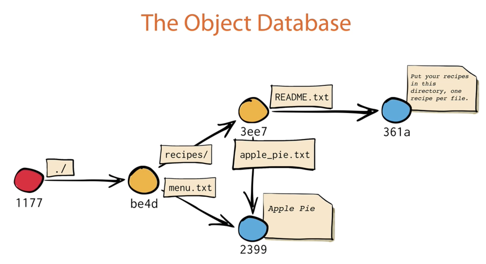

<h1 align="center"> Mastering Git Course</h1>
<h4 align="center"> Plural Sight, Paolo Perrotta </h4>
<h4 align="center"> Focus on the Git "way of thinking" </h4>

## Table of Contents

- [How Git Works](#how-git-works)
- [Introduction](#introduction)
- [Basic Workflow](#basic-workflow)
- [Git reset](#git-reset)
- [Advanced Tools](#advanced-tools)
- [Exploring the Past](#exploring-the-past)
- [Fixing Mistakes](#fixing-mistakes)
- [Finding Your Flow](#finding-your-flow)

## How Git Works 

- Any sequence of bytes -> SHA1 hash. SHA1s are 20bytes in hexadecimal format. 
- There is only one SHA1 for a piece of string. `git hash-object "Apple Pie"` command would not work. `echo "Apple Pie" | git hash-object --stdin` will return 23991897e13e47ed0adb91a0082c31c82fe0cbe5, because git considers "Apple Pie" as a file name. 
- Every object in Git has its own SHA1 and SHA1s are unique.
- Git objects: Blobs, Trees, Commits, Annotated Tags<p align="center"></p>
- ```git
   git init
   ls -a
   echo "Apple Pie" | git hash-object --stdin //23991897e13e47ed0adb91a0082c31c82fe0cbe5
   open .git  
   //open obects folder and see the folder "23". 23 is the forst 2 digits of the SHA1. 
   //Inside there's a file with the remaining digits of the SHA1 as its name. This is called a blob of data
   git cat-file 23991897e13e47ed0adb91a0082c31c82fe0cbe5 -t 
   // -t is for type. Output is : blob
   git cat-file 23991897e13e47ed0adb91a0082c31c82fe0cbe5 -p
   // -p is for print. Output is : Apple pie
   ```
- In the object database blob is not really a file, but the content of a file. The file name and the file permissions are not stored in blob, they are stored in the tree that points the blob. 
- When we `git log` we see that commits have their SHA1s and also point to trees, blobs and parent commits if they have. Trees point the same blob as before if the content is still the same. Similar thing goes with the trees; they point the same trees if that part of the files/folders has not changed. So basically Git does not store things more than once. 
- `git count-objects` command gives the ouput like: 8 objects, 32 kilobytes
- What if I have a huge file and change only a single line. Would Git copy the whole content as a blob? No it stores the differences between files.
- TAGS📍 A tag is a simple label attached to an object forever.
  ```
  git tag -a mytag -m "I love cheesecake"
  git tag
  mytag
  git cat-file -p mytag //I could write SHA1 also
  object 25080f99.............91
  type commit
  tag mytag
  tagger Paolo "Nusco" Perrotta <assaas@sasasa.com> 143601375 +2000
  
  I love cheesecake
  ```
  There is another type of tag without a specific name. Some call it un-annotated tag og lightweight tag. It's created with this command `git tag tagname`. It provides only commit hash.This tag is basically like a branch that does not move.
- BRANCH📍 A branch is just a reference/pointer to a commit. Inside of the branch file there is only a single line and it is the SHA1 of the current commit.
- Assume there is only one branch and it's master. When we run the folowing commands, both of the branch folders will contain the same SHA1. 
  ```
  git branch newbranch
  git branch
  lisa
  *master   //* is for showing current branch
  open .git/
  cat .git/refs/heads/master
  57026.................51f
  cat .git/refs/heads/lisa
  57026.................51f
  ```
- HEAD📍 HEAD file contains reference to current branch. Example: `ref: refs/heads/master`. So it's just a reference to a branch.
- Assume we have 2 branches: master and lisa. Now both branches are pointing the same commit(example: 5720), and HEAD is pointing to master branch. This moment we make one more commit. Now lisa is still pointing 5720. Master branch is pointing the new commit(ex:e268), and HEAD is till pointing master. Because it did not change. 
- CHECKOUT📍 Lets make lisa current branch: `git checkout lisa`. Two things happen: 
  * HEAD now points lisa. (Inside HEAD file -> ref: refs/heads/lisa)
  * Git replaces the files & folders in our working area or working directory with the files & folders in this commit (5720)<p align="center"></p>
- So checkout means move HEAD and update working area.
- Now we make another commit(007f). lisa will point new commit and HEAD will point lisa.
- MERGE📍 Let's turn back to master.`git checkout master` and see the previously committed files & folders. I want to merge now.`git merge lisa`. We have a conflict now (ex: both modified: recipes/apple_pie.txt). We can fix it manually with vim editor `vim recipes/apple_pie.txt`. We can see whats conflicting and edit the file content, then save and close `wq`. Now we should edit it explicitly because it's not staged `git add recipes/apple_pie.txt` and `git commit` without the need for a commit message, because it already offers `Merge branch 'lisa'`. When we look inside the new commit(ecbe) `git cat-file -p ecbe ` we see that it's just like a normal commit, like merge is just a commit. The exception is that it has two parents.<p align="center"></p>
- DETACHED HEAD📍 This happens when we checkout to a commit instead of a branch. Ex:`git checkout ecbe` `git branch` -> `*(HEAD detached at ecba) lisa master`. If we make one or more commits at this point, the HEAD keeps pointing the new commits. Then if we checkout to master again, those commits become unreachable by a commit or branch, and they are to be deleted after some time(garbage collected). However, if I want them to be stored for good, I should checkout to the latest commit, create a new branch there and checkout to master again. Detached HEAD is useful when we want to make some experiments with our code.
- REBASING📍 Assume we have two branches with a common base and each has several commits without a conflict. If we merge them we have a commit with two parent commits as explained before. If we rebase `git rebase master`, Git detaches the branch from its common base with the other branch and adds all the commits on the top of the target branch, so that they seem like a single branch. But this is not the whole case because objects are immutable. Base can not be changed. What really happens is: the commits on the right are totally copied to the left side except their parents. So they are new objects with new SHA1s. Remaining commits on the right are deleted after some time.<p align="center"></p>
- Merge preserves history as it has developed. A project with rebases looks cleaner but rebase refactors history.(ex: prior commits may look forward in history)
- DISTRIBUTED VCS📍 When we clone a git repo from remote `vim .git/config` command gives us information about it. If we `git branch` we only see *master on local. To see all branches on the remote use `git branch --all`. `git show-ref master` displays all the bramches with tha name master bth remote and local. 
- Like a local branch, a remote branch is just a reference to a commit.
- Case: I cloned a remote repo lo local and made a commit. Now I want to push it to remote, but I figure out that there is another commit made by sbd else in remote. 2 ways to go 1st way: `git push -f` I push my commit to remote and master branch on remote will point my commit. The other commit on remote will garbage collected. 2nd way: fetch the remote to local, merge & fix conflicts, then push. This way the remote will continue to have the same objects as local.(fetch-merge-push). Actually fetch + merge = pull.
- Never rebase shared commits❗️
- Fork is a remote clone. We can clone the forked repo to local, but it does not track the changes of the forked repo. There we should add the forked repo as the second remote to local. This remote is named upstream. What we can do is pull from upstream and push to origin. We can also push any code to origin we want.


## Introduction

- Four important areas:
  * (Stash) - Working Area - Index(Staging Area) - ❗️Repository 
- 2 important questions:
  * How does this command move information accross the Four Area?
  * How does this command change the repository?
- Index is a binary file in the .git folder. 
- `git diff` gives the difference between the working area and the index.
- `git diff --cached` gives the difference between the index and the repository. 

## Basic Workflow

- MOVING DATA TO THE LEFT📍 (moving from repository to index and working area). As we know `git checkout branchname` changes the HEAD from current branch to the selected one. Then the files in the index and working area changes automatically accordingly.
- REMOVING FILES📍 Assume I created a file in working area and added it to index. But I want to remove it from index now. `git rm filename` would delete the file forever. Since that file is not commited yet, Git warns me and offers two options `git rm -f filename` and `git rm --cached filename`. The second one deletes the file from the index or basically unstages it. In terms of Git `rm` is not the opposite of `add`.
- RENAMING FILES📍 Assume I changed the extension of a file in working area from menu.txt to menu.md. `git status` says that I deleted menu.txt and created menu.md. If I `git add menu.md`, the index would contain both menu.txt and menu.md. But I do not want menu.txt in the index anymore. What I should do is `git add menu.txt` which does not really exist in the working area. It sounds strange but this command will overwrite menu.txt in the index area with nothing, basically it deletes that file. This point if we `git status`, Git tells us `renamed:  menu.txt -> menu.md`, so now Git understands what I did. Therefore if I commit, repository will also understand that I only changed the extension. This will happen the same way even if I change also the content to a certain extent. In order to change the file name in both working area and the index, I could shortly have run the command `git mv menu.txt menu.md`.

## Git reset

- reset does different things in different cases.
- Which commands move branches? commit, merge, rebase, pull. None of them works only for moving branches. They move branches implicitly, like a side effect.
- `reset` is specifically for moving the current branch and optionally copies data from the repository to the other areas:
  * `--hard` copies data from the new current commit to both index and working area.
  * `--mixed` copies data from the new current commit to index. This is also the default option.  
  * `--soft` does not copy any data.
- One example reset case: In repository the head points master, and master points the commit fbe5. I make two editions in two different files in working area and commit these changes seperately in 2 different commits(0be2 and 86d3). Then I change my mind. I want to go back to the point before the two editions(fbe5) in my working area. What I should do now is hard reset. With this command `git reset --hard fbe5` master points fbe5, and the data attached to fbe5 is copied to both index and working directory. Therfore 0be2 and 86d3 become unreachable and be garbage collected.
- Another example reset case: I make changes in a file and add it to the index. Then I changed my mind and want to delete the staged data.I need to use `git reset HEAD` which means moving the branch to the commit pointed by HEAD. But the current branch is already pointing at that commit by definition. In this case the reset does not move the branch at all. This is skipping the first step of reset where it moves the branch. Second step is to copy data to index (and working area). Since we did not specify the type of reset it applies --mixin which copies data to only index. So we deleted/overwrote the unwanted staged data at index.(I could simply do the same with git `rm --cached filename`).

## Advanced Tools


