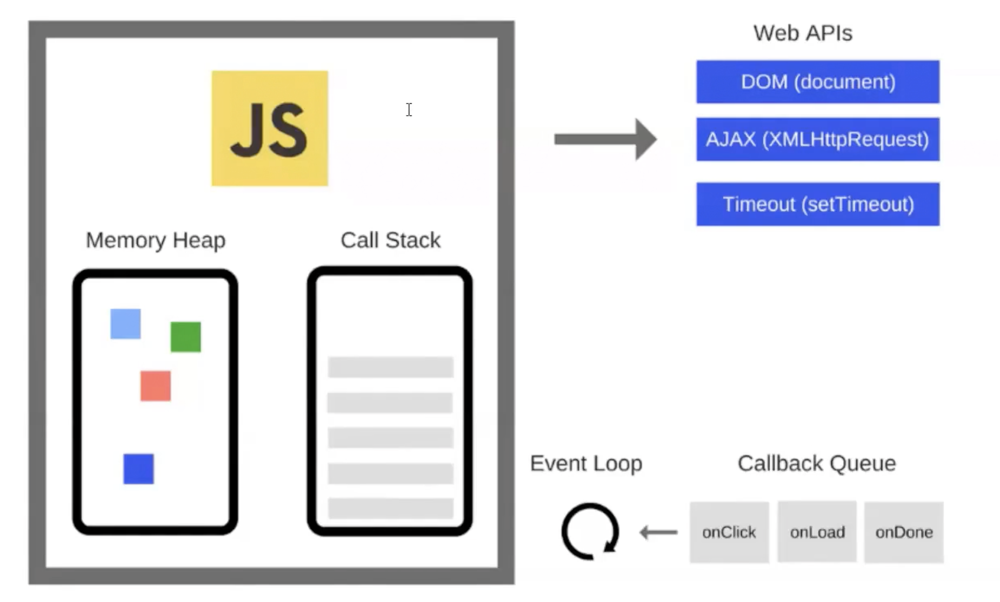
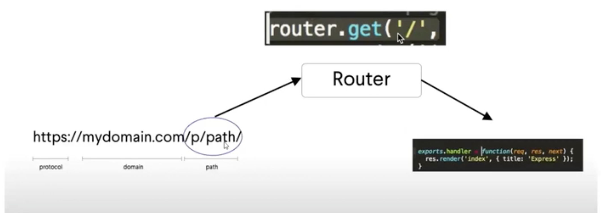
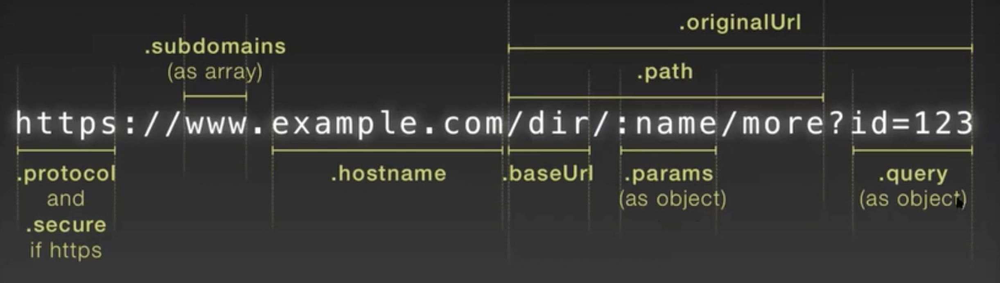

<h1 align="center">Node.js Class Notes</h1>  


## Table of Contents

- [01.12.2020](#✅Birinci_gun)
- [03.12.2020](#✅Ikinci_gun)
- [05.12.2020](#✅Ucuncu_gun)

## ✅Birinci_gun
<br/>
<br/>

- Founded by Ryan Dahl in 2009.
- 14.15.1 LTS (14-> major, 15-> minor, 1-> patch)
- What is Node.js?
  * Node.js is a platform which allows us to run JavaScript on a computer or a server.
  * So basically it allwos us to read, delete and update files.
  * Easy communicate with a database.
  
- Why do we use Node.js?
  * It uses JavaScript.
  * It's very fast. It runs on the V8 engine and uses non-blocking code.
  * There is a huge ecosystem of open source packages (npm)
  * it's great for real-time services like chat-rooms.

- MacOS ile node.js'in herhangi bir versiyonunu kullanabiliriz. `nvm use node`
- Terminal'e node yazinca alt satirda dogrudan node kodu yazabiliriz(python'daki gibi). Bu islemin ismi --> READ EVALUATE PRINT LOOP (REPL). Buradan cikmak icin 2 defa `ctrl + C` 
- Terminalde node.js dosyasini calistirmak icin  $node filename
- node.js JS ile calisir ama browser'da calisan `alert`, `window` gibi ogeleri dogal olarak calistirmaz.
- Asenkron calisir. (Yani senkron calisir ama asenkronu da destekler.)
- (JS) Event Driven bir dildir. 
− All APIs of Node.js library are asynchronous, that is, non-blocking. It essentially means a Node.js based server never waits for an API to return data. The server moves to the next API after calling it and a notification mechanism of Events of Node.js helps the server to get a response from the previous API call.<br/>
  
- Very Fast : Being built on Google Chrome's V8 JavaScript Engine, Node.js library is very fast in code execution.
- Single Threaded but Highly Scalable : Node.js uses a single threaded model with event looping. Event mechanism helps the server to respond in a non-blocking way and makes the server highly scalable as opposed to traditional servers which create limited threads to handle requests. Node.js uses a single threaded program and the same program can provide service to a much larger number of requests than traditional servers like Apache HTTP Server. (Her bir islem bir thread olarak nitelendirilir. Bu islemleri browser engine'leri tek tek yerine getiriyor)
- No Buffering : Node.js applications never buffer any data. These applications simply output the data in chunks.
- License : Node.js is released under the MIT license. (= free of charge)
- Diger ozellikler icin [link](https://www.tutorialspoint.com/nodejs/nodejs_quick_guide.htm)
- Module import etmek icin `import` yerine `require` kullaniyoruz. Cunku import'u babel sayesinde kullanabiliyorduk. Node'da babel kullanamiyoruz.
- <br/>
- Iki onemli global degisken `__dirname` ve `__filename`. Directory ve dosya pathlerini absolute olarak verirler.
- Herhangi bir paket yukledigimizde klasorumuzde alt bilesenleriyle birlikte `node_modules` klasoru ve `package-lock.json` dosyasi olusur, ancak `package.json` olusmaz.
- Yukaridakilere ilave olarak `package.json` da olusturmak istedigimizde bash terminalde `npm init` komutunu kullaniyoruz. Bu komuttan sonra asama asama `package.json` dosyasindaki bilgileri duzenlememiz veya default olarak biraktigimiza dair onay vermemiz gerekiyor. 
- ❗️ Bu islemi gerceklestirdikten sonra herhangi bir paket kurdugumda paketin bilgileri dependencies altinda otomatik olarak olusur. Eskiden yuklenen paketin dependencies'te yer almasi icin `--save` kullanilirdi. Ornek `npm i packagename --save`. Artik buna gerek yok `npm i packagename` yeterli. Ancak yukledigimiz paket sadece development kisminda yer alsin, production'da yer almasin istiyorsak kullanacagimiz komut `npm i packagename --save-dev`. Ozellikle buyuk projelerde paketlerin yuklendigi yerler onemli. 
- `npm init -y` ile en hizli bicimde tum degerler default olacak sekilde `package.json` olusturabiliriz.
- Bir tavsiye : node.js kulanirken npm, react kullanirken yarn kullanin.
- Ornek bir `package.json` icerigi:

```json
      {
        "name": "test-logger",
        "version": "1.0.0",
        "description": "This is a short description",
        "main": "index.js",
        "scripts": {
          "test": "echo \"Error: no test specified\" && exit 1"
        },
        "repository": {
          "type": "git",
          "url": "https://github.abc.git"
        },
        "keywords": [
          "test",
          "local"
        ],
        "author": "John Clarus",
        "license": "MIT",
        "dependencies": {
          "morgan": "^1.10.0"
        },
        "devDependencies": {
          "cowsay": "^1.4.0"
        }
      }
```
- Express nedir?
  node.js icin web framework'u. (Express kullaninca manuel olarak yaptigimiz bir cok seyi yapmamiza gerek kalmiyor.)
- Neden Express bu kadar yaygin? 
  * Hizli / fast
  * Belli bir forma/sarta bagli degil /unopinionated
  * Boyutu oldukca kucuk / minimalist
- 
```
   npm install express
   const express = require("express")
   express().listen()
```
- Yaygin kullanim `const app = express()`
- `app.listen(5000, ()=>{console.log("I am listening on port 5000")})` .listen callback function alir.
- Kodda yaptigimiz degisikliklerin islev gormesi icin her degisiklik sonrasinda server'i restart etmemiz gerekiyor. Bizi bu zahmetli isten kurtaran paket nodemon.
`npm i nodeman --save-dev`. 
- Bunu kurduktan sonra ne yapiyoruz? package.json dosyasi icindeki script altina `"start" : "nodemon"` yazip `npm start` vaya `npm run start` ile calistirdigimizda her save ettigimizde yaptigimiz degisiklikler etki ediyor. Bunun yerine terminale sadece `nodemon` yazarak da nodemonu aktif hale getirebiliriz.
- start'in default degeri `"node index"` idi. Bunlari silip sadece nodemon yazdiktan sonra bile index dosyasi calisir. Neden? Cunku index.js main'in karsisinda yer aliyor (`"main": "index.js"`)ve program her zaman main'in belirttigi dosyayi calistirir.
- <br/>
- query bir object'tir. console.log(req.query)  //localhost:5000/user?no=12  //{no:12}
-
```
 //localhost:5000/user?no=12
  url => /user?no=12
  baseUrl =>
  original Url => /user?no=12
  path => /user
  query => {no:12}
```
- Express icin onemli moduller.
  * os => built-in bir module'dur server isletim sistemi bilgilerini doner. `os.type` , `os.platform()`, `os.freemem()`, `os.totalmem()`
  * path => Dosya pathlerine dogru olarak ulasmaya yardimci olur.`const custompath = path.join(__dirname, "/testFolder")`. 
  * `path.normalize(wrogPathname)` ile eksik/yanlis yazilmis path'ler duzeltilir. Ornek ters-duz slash (/\).
  * `path.extname(filename)` dosya uzantisini verir.<br/>
  
## ✅Ikinci_gun

- Projemizi heroku gibi platformlara yukledigimizde local port konusunda sorun yasayabiliriz. Bunun cozumu icin:
  * `const port = process.env.port || 5000;`
- Express ile text gonderebildigimiz gibi file da gonderebiliriz.
  * `app.get("/", (req,res)={response.send("Hello from server")})`
  * `app.get("/", (req,res)={response.sendFile(path.join(__dirname,"about.html"))})` Ancak bu dsya gondermek icin tercih edilen bir yontem degildir.
- Template denince MVC modelinin view tarafinda kullanilan icerisinde belirlenen bosluklari doldurup kullanacagimiz bir sablon gelsin. Ornek `<%=title%>`
- Express'i destekleyen pek cok template var. Biz bunlardan EJS(Embedded JS template engine)'i kullanacagiz, ayrica Pug da gorecegiz. (expressjs.com/resources/template-engines.html)
- Templateler bizim dinamik web sayfasi olusturmamizi saglar. 
- ejs paketini kur -> `npm i ejs`
- Proje klasoru icinde view isimli bir klasor olusturalim. Icinde main.ejs isimli bir template file olsun. Bu dosyaya erisim icin render metodu ve set ayarlari yapmamiz gerek.
- 
```javascript
   app.set("view engine", "ejs");
   app.set("views", path.join(__dirname, "views"));
   
   app.get("/", (req, res)=> {
    res.render("main");
   });
```
- Burada views klasorunu set ettik, bu klasor icine giren tum ejs dosyalarini kullanabiliriz. Dosyalari tek tek set etmeye gerek yok. 
- render, bir templeyti derleyip sonucunu gondermek icin kullaniliyor.
- `get` ve `use` farki. `get`te icindeki sarti saglar ise fonksiyonu dondurur. use'da => gelen butun talepler use'a ugrar, `""` icerisindeki sarti saglarsa fonksiyonu calistirir.  
- Node'da react'ta oldugu gibi routes kullanabiliriz. Bunun icin proje klasoru latina routes isimli bir klasor ve altina MainRouter.js dosyasi olusturuyoruz.
- Sorasinda index.js'deki get'in callback fonksiyonunu MainRouter'a tasiyoruz. 
- 1️⃣ Mainrouter.js icinde
```javascript
   exports.getMain = (res,req)=> {
     res.render("main");
   }
   //exports objesine getmain'i yerlestirdik.
```
- index.js icinde
```javascript
   const MainRouter = require("./routes/Mainrouter");
   
   app.get("/", MainRouter.getMain)
```
- 2️⃣ express kullanimi ile MainRouter.js
```javascript
  const express = require("express");
  const router = express.Router();
  
  router.get("/", (req,res)=> {
   res.render("main");
  });
  
  module.exports = router
```
- express kullanimi ile index.js
```javascript
   const MainRouter = require("./routes/Mainrouter");
   
   app.use("/", MainRouter)
   
   //Dikkat artik get degil use kullaniyoruz
```
- ❗️ index.js'te app.use icinde "/user" ifadesi belirledik diyelim. Bu ifadeyle baslayan tum istekleri UserRouter.js'e gondermis olalim (bu az onceki MainRouter.js gibi islev goren bir dosya). Bu dosya icinde yazacagimiz get icindeki  `"/"` ifadesi `"/user"`a denk geliyor. Ornegin `router.get("/add", .. ` dersek de bu `/user/add` anlamina gelir.
- AMACIMIZ MVC YAPISI KURARAK ISTEKLERE CEVAP VERMEK.
- Simdi template'e bir degisken gonderelim. Yukarida belirttigimiz router icindeki render'a bir parametre daha ekliyoruz. `res.render("main", {name : "John"})`. 
- ejs templeyti icindeki karsiligi 
```html
<body>
   HELLO <%=name%>
</body>
```
- Browser'da gorunen => HELLO John
- name'i query olarak alalim. Adres cubugundaki url'e => `localhost:5000/?name=jane` yazalim. 
- url'de ? var ise bunun oncesi domain, sonrasi query'dir.
- MainRouter.js icindeki render => `res.render("main", {name : req.query.name})`.
- Browser'da gorunen => HELLO John
- Name gelmezse "HELLO Stranger donsun"
```html
<body>
    
   <% if(name) { %>
      <h1> HELLO <%=name%> </h1>
   <% } else { %>
        <h1> HELLO Stranger </h1>
   <% } %>
   
</body>
```
- Simdi de object formatinda bir veriyi templeyt ile map edelim.
- Once models isimi bir klasor olusturup icine data.js dosyasini ekliyorum. Icerigi:
```javascript
 exports.userList =  [
  { id : 0, name : "Nick"},
  { id : 1, name : "Rick"},
  { id : 2, name : "Mary"},
  { id : 3, name : "Gordon"},
 ];
```
- UserRouter.js icerigine:
```javascript
 const data = require("../models/data");
 
 
 router.get("/", (res,req)=>{
   res.render("user", {users : data.userList});
 });
```
- users.ejs'te body icinde:
```html
 User List: 
 <% users.forEach(user => { %>
 
    <p> <%=user.name %></p>
    
 <% } %>
```
- params ile yapalim
- UserRouter icinde
``` javascript
 router.get("/:id", (res,req)=>{
   res.render("user", {users : data.userList, id: req.params.id});
 });
```
- users.ejs'te body icinde:
```html
 <% if(id) { %>
    
    Hello <% user[id].name %></p>
    
 <% } %>
```
## ✅Ucuncu_gun
```

- app.get("/user", ) deyince /user path inden  get methodu ile  bir istek gelirse şunu uygula, şu cevabı gönder gibi bir anlama geliyor.
app.use de buna karşılık ne diyebiliriz? -> gelen isteğin methodu ne olursa(get, post, put vb) olsun şu cevabı gönder.

