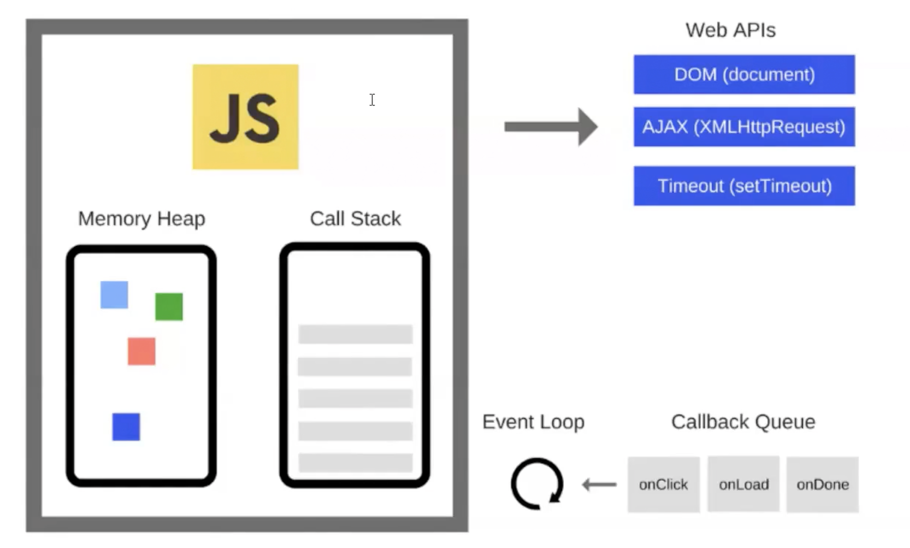

<h1 align="center">Node.js Class Notes</h1>  


## Table of Contents

- [Giris](#Giris)

## Giris
//////////01.12.2020
- What is Node.js?
  * Node.js is a platform which allows us to run JavaScript on a computer or a server.
  * So basically it allwos us to read, delete and update files.
  * Easy communicate with a database.
- Why do we use Node.js?
  * It uses JavaScript.
  * It's very fast. It runs on the V8 engine and uses non-blocking code.
  * There is a huge ecosystem of open source packages (npm)
  * it's great for real-time services like chat-rooms.

- MacOS ile node.js'in herhangi bir versiyonunu kullanabiliriz. `nvm use node`
- Terminal'e node yazinca alt satirda dogrudan node kodu yazabiliriz. Bu islemin ismi --> READ EVALUATE PRINT LOOP (REPL). Buradan cikmak icin 2 defa `ctrl + C` 
- node.js JS ile calisir ama browser'da calisan alert, windows gibi ogeleri dogal olarak calistirmaz.
- Asenkron calisir. Aslinda senkron calisir ama asenkronu destekler.
- Asynchronous and Event Driven − All APIs of Node.js library are asynchronous, that is, non-blocking. It essentially means a Node.js based server never waits for an API to return data. The server moves to the next API after calling it and a notification mechanism of Events of Node.js helps the server to get a response from the previous API call.<br/>
  
- Very Fast − Being built on Google Chrome's V8 JavaScript Engine, Node.js library is very fast in code execution.
- Single Threaded but Highly Scalable − Node.js uses a single threaded model with event looping. Event mechanism helps the server to respond in a non-blocking way and makes the server highly scalable as opposed to traditional servers which create limited threads to handle requests. Node.js uses a single threaded program and the same program can provide service to a much larger number of requests than traditional servers like Apache HTTP Server.
- No Buffering − Node.js applications never buffer any data. These applications simply output the data in chunks.
- License − Node.js is released under the MIT license. (= free of charge)
- Diger ozellikler icin [link](https://www.tutorialspoint.com/nodejs/nodejs_quick_guide.htm)
- Module import etmek icin `import` yerine `require` kullaniyoruz. Cunku node import'u babel sayesinde kullanabiliyorduk.  
- package.json icerigi

```
      {
        "name": "test-logger",
        "version": "1.0.0",
        "description": "This is a short description",
        "main": "index.js",
        "scripts": {
          "test": "echo \"Error: no test specified\" && exit 1"
        },
        "repository": {
          "type": "git",
          "url": "https://github.abc.git"
        },
        "keywords": [
          "test",
          "local"
        ],
        "author": "John Clarus",
        "license": "MIT",
        "dependencies": {
          "morgan": "^1.10.0"
        },
        "devDependencies": {
          "cowsay": "^1.4.0"
        }
      }
```

