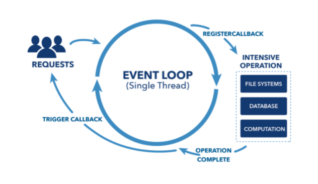

<h1 align="center">Question & Answers</h1>

## Table of Contents

- [General](#General)
- [HTML & CSS & SASS](#HTML_CSS_SASS)
- [JavaScript](#JavaScript)
- [React & React-Native](#React_React-Native)
- [Node.js](#Node_js)


## General
- WHAT IS CLEAN CODE? 
- Clean code means to write code in a way that everybody can easily read and follow. Or in a way that when you want to turn back to your own code for example after one year you can still grab the code.<br/>
Basic rules here are to write relevant and understandible content, especially when defining variables and function names; and avoid duplication. <br/>
In this manner the code would be more understandable by everyone inclued.
  <hr/>

## HTML_CSS_SASS
- WHAT IS SASS? <br/>
- SASS is the short form of Syntetically Awesome Style Sheets. It is a preprocessor scripting language that is compiled to CSS. <br/> Advantages of SCSS are: <br/>
  * It enables an easier syntax when styling numerous nested elements under each other.
  * It helps seperating the code into easily managable parts and import them back to main style file.
  * We use "mixins" which are verysimilar to functions in programming languages. So that you do not have to write the same styling code several times. 
  <hr/>
  
## JavaScript
- WHAT IS THE DIFFERENCE BETWEEN LOCAL AND SESSION STORAGE? 
- Local and session storages are used to store key-value pair in the browser, so that they are not sent to the server side oneavh request. Most browsers can store up to 10MB, which is pretty good of this type. <br/>
When it comes to the difference between these two; the stored data in local storage has no expiration unless it's cleared manually, on the other side in session storage the data is cleared every single time the browser is closed.
  <hr/>
- WHAT IS THE DIFFERENCE BETWEEN NULL AND UNDEFINED IN JS? 
- First of all they are two seperatye types. Null is an object and undefined is undefined as a type. When you create a variable like "var variable_1" and assgin no value, the variable stays undefined until a value is assigned. On the other side you can assign Null to a variable as a value, which represents emptiness. <br/>
When you compare undefined with Null using strict equality (===), you get false, because they are different types, but when you compare them with abstract equality (==) you get true. Because the two represent empty value.
  <hr/>
- WHAT IS OBJECT DATA TYPE IN JS?
- JS is an object oriented programming language. It means the programming mindset in JS is centered around objects rather than functions. If we disregard the primitive data types like string, number, boolean etc, all remining data types are objects in JS. In object data types we can store as many data as we want by using key-value pairs. Key part is alwaysa string, but value is an area we can assign any data type, and a function as well.<br/>While primitive data types are immutable, object type is completely flexible. You can assign, append, modify or delete any data by calling the key, and by using methods and properties to do manipulation. It makes really handy especially when working with numerous variables at a time. <br/> Because of these features object data type is very widely used in programming languages, and in JS as well.
  <hr/>
- HOW IS DOM UTILIZED IN JS?
- DOM stands for Document Object Type, and is one of the standards of the World Wide Web Consortium(W3C). It is an interface free from platform and language allowing the programs or scripts to dynamically access and manipulate the content,  structure and the style of a document.<br/> DOM itself os not a programming language but without it JS would not be able to used to access HTML documents. When we consider an HTML document, all the objects are organized in an hierarchy following the sequence:
  * Window object
  * Document object
  * Form object
  * Form control elements<br/>
JS has numerous DOM methods which allow the program to access and manipulate every single element in an HTML document.
  <hr/>
 
## React_React-Native
- REACT vs REACT-NATIVE?
- React js is a JS library that supports both front end and server. Moreover, it can be used to create UI for websites and mobile apps. It came into life in 2011 with facebook, and a year after it began to be used with Instagram. On the other side, react-native is a cross platform mobile framwork that uses React js. for building mobile apps. Main similarity between React and React-Native is that they are both ideal for building dynamic and high performing interfaces. React native differs from React in a way that it targets mobile area. <hr/>
  <hr/>
  
- REACT ADVANTAGES & DISADVANTAGES
  * Uses virtual DOM which is a JavaScript object. This will improve apps performance since JavaScript virtual DOM is faster than the regular DOM.
  * Can be used on client and server-side as well as with other frameworks.
  * Component and data patterns improve readability, which helps to maintain larger apps.
  * -
  * Covers only the view layer of the app, hence you still need to choose other technologies to get a complete tooling set for development.
  * Uses inline templating and JSX, which might seem awkward to some developers.
  <hr/>
  
- WHAT ARE THE ADVANTAGES OF REACT-NATIVE?
- ANSWER
  * React Native is based on “Learn Once Write Everywhere” approach to equip developers with a tool that only needs to be learned once, just in a single language and then can be reused on both iOS and Android mobile platform.
  * React Native offers cross-platform development and a real experience to developers allowing them to build only one app with effectively 70% code sharing between different platforms.
  * React Native helps in faster development. Building one app instead of two using a common language gives speedier app deployment, delivery, and quicker time-to-market.
  * React Native exists with essential components for ending of native apps as the app development ends with native look and feel.
  * React Native has a large community of developers for its security. The developers are always ready to fix bugs and issues that occur at any instant. They improve the performance of React Native from time to time with the best practices possible.
  * React Native supports Live and Hot Reloading. Both are different features. Live Reloading is a tool that helps in compiling and reading the modified files. Hot Reloading is based on HMR (Hot Module Replacement) and helps to display the updated UI content.
  <hr/>
- WHAT IS JSX?
- JSX stands for JS in XML. It allows the developer to create HTMl elements and place them in DOM without using the methods ```create element``` or ```appendChild```. It converts HTML tags into React elements, or very shortly JSX is a React extension that allows us to write JS codes that look like HTML elements.
  <hr/>
  
- NATIVE & CROSS-PLATFORM APPS
- Native apps are developed exclusively for a specific platform. Apple for instance prefers Objective-C and Swift, while Google favors Java for Android. Using those compatible languages developers can better utilize features of the devices. A native developed app for IOS would not work on Android and vica versa. On the other hand cross platform apps are compatible with multiple platforms. Owing to the dominance of twomajor platforms in the market, most cross platform apps focus on IOS and Android. Positive things with cross platform apps is that they provide a universial solution. However, you run the risk of losing quality and tailored solutions for individual devices.
  <hr/>
  
- REACT HOOKS?
- React hooks were introduced in 2018, which is simply after 7 years of the first debut of react. Hooks are functions that let you use state and other react lifecycle features without having to write a class. This helps us manipulate the state in a much easier way. Basic built-in react hooks are useState, useEffect and useContext.  useState returns a stateful value and a function to update it. useEffect lets you perform side effects in function components such as componentDidMount, componentDidUpdate and componentWillUnmount. Two basic rules of hooks are that they are not called inside loops, conditions, or nested functions. (Only called at the top level.), and they are also not called from regular JavaScript functions, instead from React function components.
  <hr/>
  
- WHAT ARE HYBRID APPS?
-	Hybrid apps are deployed in a native container that uses a mobile WebView object. When the app is used, this object displays web content thanks to the use of web technologies (CSS, JavaScript, HTML).
 <hr/>
 
- WHAT ARE NATIVE APPS?
-	They are built for specific platforms and are written in languages that the platform accepts. For example, Swift and Objective-C for native iOS apps and Java or Kotlin for native Android apps. Native apps are also built using the specific Integrated Development Environment (IDE) for the selected operating systems.
 <hr/>
 
- WHAT ARE THE ADVANTAGES OF NATIVE APPS OVER HYBRID APPS?
  * They work efficiently as they are built for that specific platforms
  * Native apps are responsive on all the platform-specific devices
  * They are very fast and the best in the app performance
  * Native apps better integrate with mobile hardware
  * They have interactive and intuitive User Interface (UI) and User Experience (UX) as per the user expectations based on specific platforms
  * Some of the Native mobile apps work even without the Internet connection
  * Native apps are secured and reliable
  * They can easily access or utilize the other device-specific capabilities like GPS, Camera, Contacts, etc.
   <hr/>
   
- REAL DOM - VIRTUAL DOM?<br/>
  Perhaps the most important part of React is the concept of the virtual DOM.
  * Real DOM: DOM stands for “Document Object Model”. The DOM in simple words represents the UI of your application. Every time there is a change in the state of your application UI, the DOM gets updated to represent that change. Now the catch is frequently manipulating the DOM affects performance, making it slow.
  * Virtual DOM: That’s where the concept of virtual DOM comes in and performs significantly better than the real DOM. The virtual DOM is only a virtual representation of the DOM. Every time the state of our application changes, the virtual DOM gets updated instead of the real DOM.
  <hr/>

 
## Node_js
- WHAT IS MVC (MODAL VIEW CONTROLLER)
- Today the websites can be very advanced and can implement a lot of computational process. To make working with such web applications easier, developers use different patterns to lay out their projects. In this respect the most popular pattern is MVC. The goal of this pattern is to split a large application into specific sections each its own purpose. As regards to its abbreviation, the model consists of three different sections: the controller, the model and the view. In this pattern controller acts as a bridge between two other components and is responsible for the flow of the requests. It tells the rest of the sections what to do. Model section is responsible for the logic of the model and interacts with the database. The view is only concerned with the presentation of the data coming from the controller. It contains a template file that dynamically renders html based on this data. <br/><br/>
The important thing to about this design is that the model and the view do not interact with each other. Any reaction between the model and the view is carried out through the controller. It means that the presentation and the logic of the data are completely seperated which makes complex applications pretty easier. <br/><br/>
Imagine a user sends a request to the controller to see the list of city names, the controller sends the request to the model to get the city names and the model returns the list to the controller. If the controller gets the list successfully, then it turns to the view. The view renders the data into html so that it can be used by the browser. Now the controller takes the presentation and return it back to the user. If the controller gets an error from the view, then it asks the view to render a presentation of the error. This case an error is returned to the user instead of the city names list. In sum; the model handles all the data,  the view handles all the presentation and the controller tells the these two what to do. This is the basic architecture of MVC.
 <hr/>
- WHAT IS NODE.JS? HOW DOES IT WORK?
<br/><br/>
- Node.js is a virtual machine that uses JavaScript, and runs on a v8 environment. When we talk about Node.js, we are implying that we are using it as a way to create server and interact with our database on the backend.

JS is asynchronous and single threaded. The single thread is the event loop which is responsible for running all functions and requests. The asynchronous behavior is extremely important when using node, because it guarantees that the event loop is never blocked by a synchronous function.

Even though there is only one event loop, when a request is made the loop passes the request to an asynchronous function which does the work. When this function is done and a response is returned, it can then be passed back to the event loop to be executed by the callback and sent to the user.

The main benefit of a Node.js server is that it can handle much more traffic than a conventional server, and it offers a huge ecosystem of open source packages.
  <hr/>
- WHAT IS THE DIFFERENCE BETWEEN ASYNCHRONOUS AND NON-BLOCKING? <br/>
- The two terms are quite similar to each other. Both of the models aim that the main program keeps flowing while a time consuming process is being done in the meantime. But there is a small difference between these two. 

Asynchonous calls usually involve a callback or an event, to give a notification that the response is available. For example the API we are calling will return after we call it. In the background the program starts a process to fulfill the task, and once the API is pulled, the task is done. By the time the main flow of the code does not stop or wait.

While in the case of non-blocking, again you make a system call, it will return immediately with either the result or an error without putting the thread to slow down. In these cases the caller might have to try again to get the rest of the data. The term non-blocking is mostly used with IO operations.

  <hr/>
- WHAT ARE BENEFITS OF NODE.JS? <br/>
- The most important benefits of Node include:
  * It makes it really fast to build real-time, high-traffic apps like chats or gaming 
  * It makes it possible to code in JavaScript for both the client and server side 
  * It increases the efficiency of the development process as it fills the gap between and backend developers,
  * The extensive open source community and ever-growing NPMs gives developers multiple tools and modules to use, 
  * THE code executes faster than in any other languages,
  * Node is perfect for micro services which are a popular solution among enterprise applications.

  <hr/>
- WHAT IS SHARDING IN MONGO DB? <br/>
- Sharding is the process of distributing data across multiple servers, which goes well along with horizontal scaling. MongoDB uses sharding to support deployments with very large data sets and operations that require intensive calculations. Sharding adds more servers to a database and automatically balances data and load across various servers. Each database or namely shard in the server serves as an independent database, but together shards act like a singe logical unit. It provides additional write capacity by distributing the write load over a number of mongoDB instances, and that reduces the number of operations each shard handles.

  <hr/>
