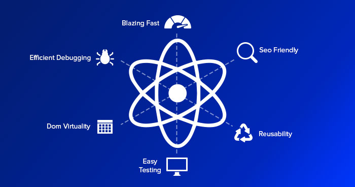

<h1 align="center">React Class Notes</h1>  

 
## Table of Contents

- [Giris](#Giris)

## Giris
//////////10.11.2020
- React bir library'dir framework degildir.
- Bu terimleri cok iyi sekilde aciklayabilmeliyiz.
- Framework ? Bir uygulamayi tamamen calisabilir sekilde sunar
- Library ?
- Model View Controller (MVC)
- Boiler Plate ? Calisan/canli bir uygulama verir
- node bir engine'dir. npm -> Node package manager
- npx bizde olmayan bir paketi calistirir.
- npm'de guncel paketi takip etmemiz gerekir
- `npx create-react-app app-name` `cd appname` `npm start` / `yarn start`
- Proje ya yarn ya da npm ile kurulur. yarn ile baslatilan projede yarn.lock dosyasi, npm ile kurulan projede package-lock.json dosyasi olusur. Build zamani geldiginde ikisinin de ayni projede olmasi arzu edilmez, hatta terminalde uyari da verebilir. 
- React syntax'inde her tag kapatilir.
- Return edilen degerler bir div icerisinde yer alir. Sibling seklinde return olmaz. Return edilen divi icine child'lar yerlestirilir.
- React --> functional programming
